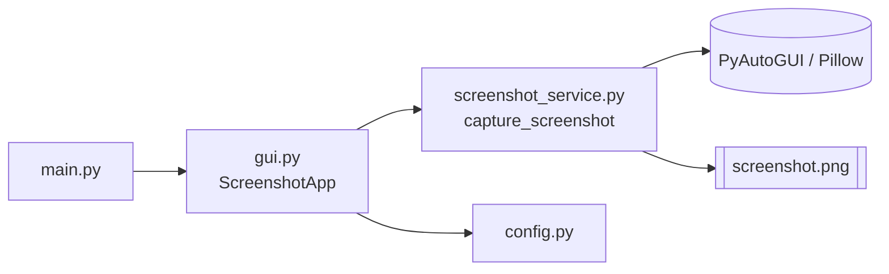

# Architecture Diagram (placeholder)

> Replace this with your exported image, e.g. `architecture.png`.

```mermaid
flowchart LR
    main[main.py] --> gui[gui.py<br/>ScreenshotApp]
    gui --> service[screenshot_service.py<br/>capture_screenshot]
    gui --> config[config.py]
    service --> pyautogui[(PyAutoGUI / Pillow)]
    service --> file[[screenshot.png]]
```
