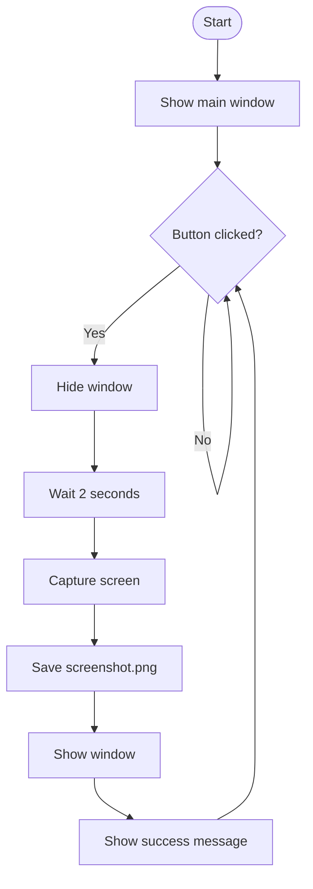

# Flowchart (placeholder)

> Replace this with your exported image, e.g. `flowchart.png`.

```mermaid
flowchart TD
    A([Start]) --> B[Show main window]
    B --> C{Button clicked?}
    C -- No --> C
    C -- Yes --> D[Hide window]
    D --> E[Wait 2 seconds]
    E --> F[Capture screen]
    F --> G[Save screenshot.png]
    G --> H[Show window]
    H --> I[Show success message]
    I --> C
```
