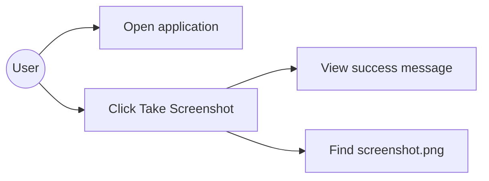

# Use Case Diagram (placeholder)

> Replace this with your exported image, e.g. `use_case.png`.

```mermaid
flowchart LR
    User((User)) --> UC1[Open application]
    User --> UC2[Click Take Screenshot]
    UC2 --> UC3[View success message]
    UC2 --> UC4[Find screenshot.png]
```
